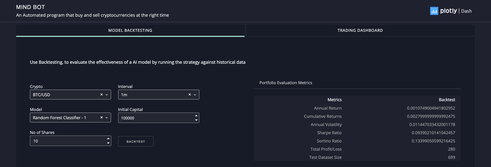
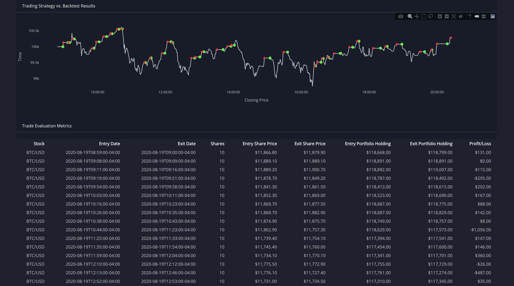
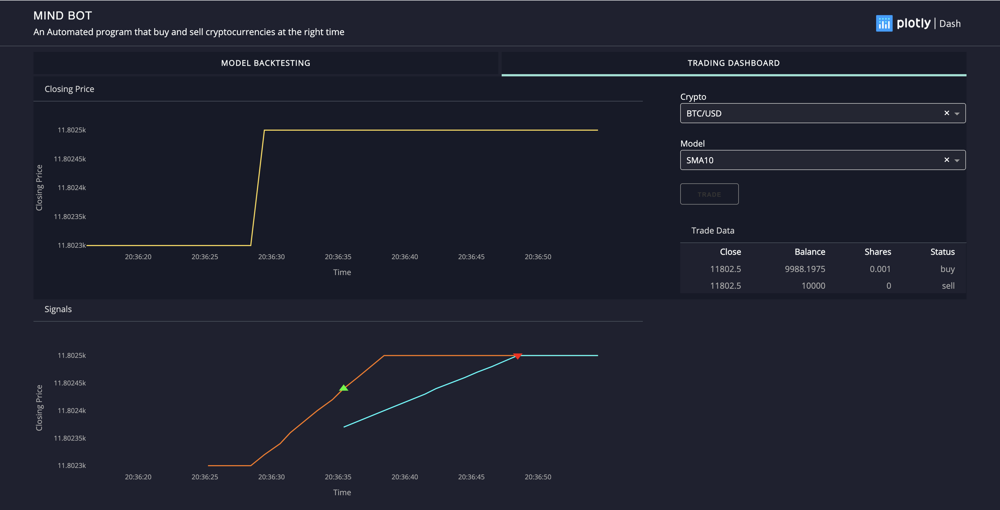

# Mind Bot

A cryptocurrency trading bot is a software program designed to recognize the crypto-market’s trends and automatically execute trades. A trading bot takes the monotony of pushing the buy and sell button physically and trades on the trader’s behalf.

## Features

* [Machine Learning Model](#Machine-Learning-Model)
* [Backtesting](#Backtesting)
* [Trading Automation](#Trading-Automation)
* Dash (UI)

## Machine Learning Model

Here we used Random Forest Classifier to predict whether to buy or sell the crypto based on the trading signals we used. We have two Random Forest Classifier Model trained by last 5 year of data. Used TAlib library for calculating the trading signals.

- Model 1 :random_forest_model_1.joblib
    - Exponential Moving Average based on Closing Price
    - Exponential Moving Average based on Volumn
    - Bollinger Bands
    
- Model 2 :random_forest_model_2.joblib
    - Simple Moving Average
    - Exponential Moving Average
    - Relative Strength Index (RSI)
    - Stochastic Oscillator
    - Moving Average Convergence/Divergence (MACD)
    - Bollinger Bands  
    
## Backtesting

Backtesting is a key component of effective trading system development, that seeks to estimate the performance of a strategy or model if it had been employed during a past period. It is accomplished by using the Machine Learning model, test with trades that would have occured in the past and evaluate the result.

## Trading Automation

n automated trading system (ATS), a subset of algorithmic trading, uses a computer program to create buy and sell orders and automatically submits the orders to a market center or exchange. The computer program will automatically generate orders based on predefined set of rules using a trading strategy which is based on technical analysis, advanced statistical and mathematical computations or input from other electronic sources.

Here we used Random Forest Classifier model to decided whether we are good buy or sell the crypto. For similicity We have added the Simple Moving Average(SMA10) implemented along with Simple Moving average.

## Run File

1. Install all dependencies - [requirement.txt] (/requirements.txt)
2. Install TALib Library as its not in requirement.txt
3. Goto File [run.ipynb](/run.ipynb)
4. Run the first cell and you can find other helpful stuffs and links

## Demo

### Backtesting

### Trading Bot

